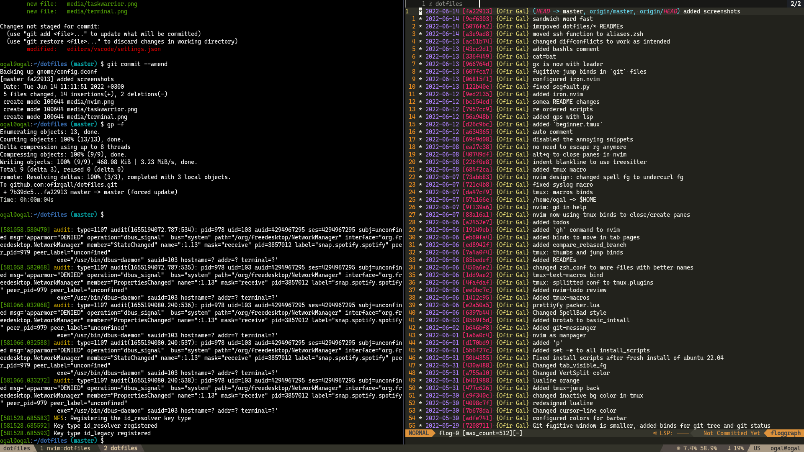

# Ofir's DotFiles

# Editor - [Neovim (nvim)](https://github.com/neovim/neovim)


# Terminal - [alacritty](https://github.com/alacritty/alacritty) with [tmux](https://github.com/tmux/tmux) that runs [zsh](https://wiki.archlinux.org/title/zsh) with [zinit](https://github.com/zdharma-continuum/zinit)


# Task Managment - [taskwarrior-tui](https://github.com/kdheepak/taskwarrior-tui)


# My Workflow
Each workspace usually has 2 windows, terminal with tmux session attached and a webbrowser attached to the tmux session by [tmux-browser](https://github.com/ofirgall/tmux-browser).
The only workspace that uas more 2 windows is the `main` session which runs `slack`, `spotify` and other GUIS I must use. \
I jump between the workspace fast with [tmux-go](https://github.com/ofirgall/tmux-browser)

How I use nvim for [everything everywhere all at once](editors/nvim/README.md).

Q: Why don't you use i3? \
A: This way I have only 2 windows per workspace and I can jump between them with ctrl+tab I don't need tiling manager, I do everything from the terminal.

---

# WARNING
This repo is mainly for saving my dotfiles, I don't recommend to clone and install it. \
Feel free to use it as reference to your own dotfiles/config setup

## Custom Key Mapping
Done by dconf (gnome tweaks):
* Capslock is mapped to Escape - Don't move your hands when escaping insert mode.
* Both shift changes language - Don't move your hands while typing.
* Right Alt is mapped to backspace - Same idea.. (done with ~/.xmodmap too)
* Changing workspaces - Ctrl+J/H, Ctrl+Shift+J/H
* [tmux-go](https://github.com/ofirgall/tmux-go) shortcuts, Alt+G, Super+J/K/L/M

---

# Install
### Enable pre-commit hook for saving stuff (like dconf)
```bash
ln -s ../../pre-commit .git/hooks/pre-commit
```

### Set Git User
Set your `global` git user at ~/.git_user
```
[user]
	name = "Your Name"
	email = "yourname@gmail.com"
```

### Clone and Run
#### Config
* `touch ~/.remote_indicator` - if remote
* `touch ~/.no_sudo_indicator` - if no sudo on machine
```bash
git clone https://github.com/ofirgall/dotfiles.git && cd dotfiles && ./install
```

### Install TamperMonkey scripts
* Install [TamperMonkey](https://www.tampermonkey.net/)
* View the the [tampermonkey scripts](tampermonkey) as raw

---

## TODO
* tmux-go: last will be saved when moving from and not moving to
* nvim - title generator
* nvim - git-messanger support multiple lines (maybe like gh)
* tmux - Neo-Oli/tmux-text-macros integrate tmux fzf menu
* tmux - Neo-Oli/tmux-text-macros better syntax for custom-macros
* nvim - diffconflicts isn't perfect yet (need to test with multiple conflicts in file + merges that solved)
* nvim - autosuspend Lsp/nvim if not active
* nvim - on save session ignore more file like flog diffview fugitive and such
* nvim - learn to use marks
* zellij
* firenvim - paste
* nvim - fix neogen next/prev (collides with snippy (tab/s-tab))
* increase osc52 yank amount (when alacritty will support that)
* git squash - if master/base branch moved forward can't find the ref
* nvim - build & run + quickfix errors
* nvim - try distant one day
* tuis to try - slack, mail, calander, jira
* autoupdate dotfiles on remote machines

## TODO Takes time
* tmux-go
* when opening link ask to which session (can be in taskopen shortcut for now and later inside tmux-browser (maybe a webbrowser wrapper))
* backup non-dotfiles - tmux sessions, tasks of taskwarrior, nvim sessions
* backup firefox extnesions & settings
* tmux - better session workflow, session per feature:repo, fzf for features -> fzf for repo
* convert todos to tasks/issues


## Improvements Ideas
* nvim? - signature renaming using tree sitter and LSP
